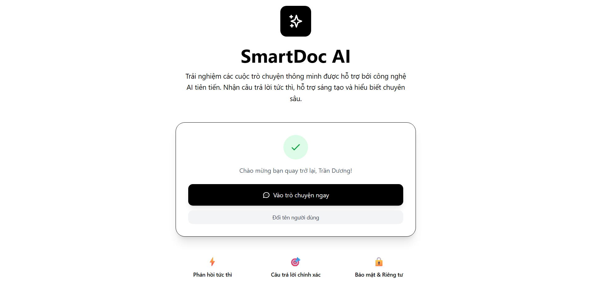
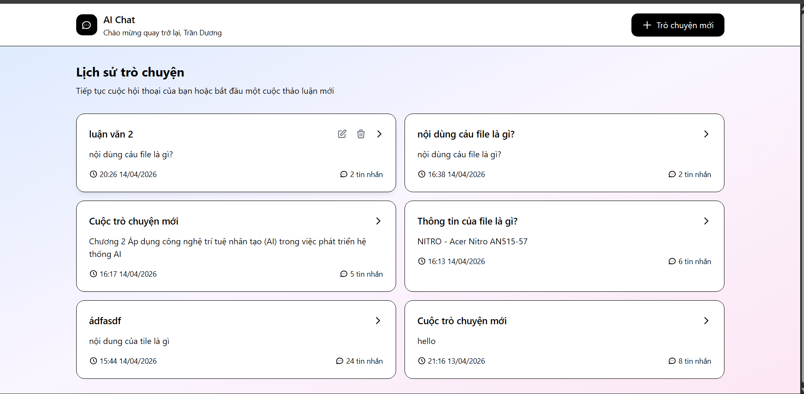
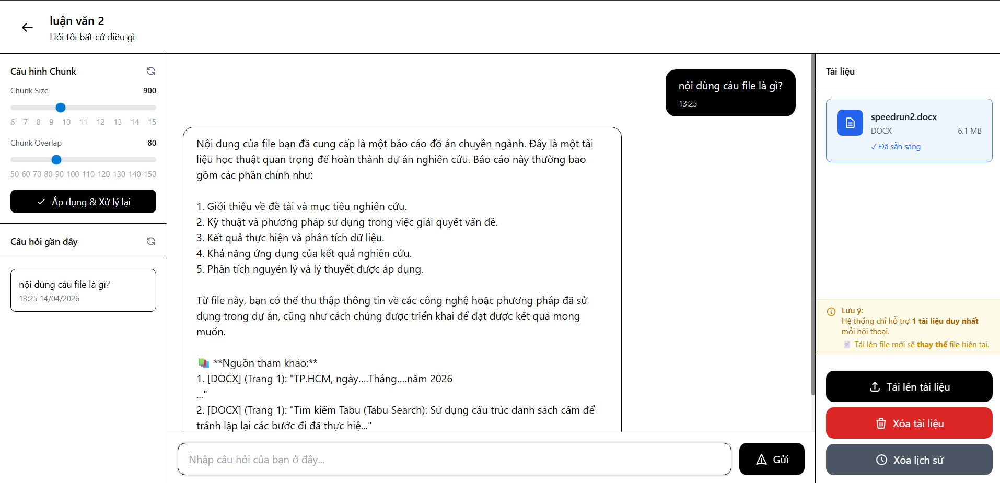

# 📚 SmartDoc AI V2 - Hướng dẫn cài đặt và sử dụng

## Giới thiệu

SmartDoc AI V2 là một ứng dụng trò chuyện thông minh cho phép người dùng tải lên tài liệu PDF và đặt câu hỏi về nội dung tài liệu. Ứng dụng sử dụng công nghệ RAG (Retrieval-Augmented Generation) với mô hình Qwen2.5:1.5b chạy local qua Ollama, đảm bảo bảo mật và riêng tư tuyệt đối.

## Yêu cầu kỹ thuật

### Phần cứng
- **CPU**: 4 cores trở lên (khuyến nghị 8 cores)
- **RAM**: 8GB trở lên (khuyến nghị 16GB)
- **Ổ cứng**: 10GB dung lượng trống
- **GPU**: Không bắt buộc, nhưng khuyến nghị có GPU để tăng tốc xử lý

### Phần mềm
- **Hệ điều hành**: Windows 11, macOS 11+, hoặc Linux (Ubuntu 20.04+)
- **Python**: 3.12.10 trở lên
- **Docker**: (tùy chọn) để chạy Ollama
- **Git**: Để clone repository

## Cài đặt

### Bước 1: Clone repository từ GitHub

```bash
git clone + url
cd smartdoc-ai
```

### Bước 2: Tạo và kích hoạt môi trường ảo (Virtual Environment)

**Windows:**
```bash
python -m venv venv
venv\Scripts\activate
```

**macOS/Linux:**
```bash
python3 -m venv venv
source venv/bin/activate
```

### Bước 3: Cài đặt các thư viện Python

```bash
pip install -r requirements.txt
```

### Bước 4: Cài đặt Ollama

#### Cách 1: Cài đặt trực tiếp (Windows/macOS/Linux)
Truy cập [https://ollama.ai/download](https://ollama.ai/download) và tải phiên bản phù hợp với hệ điều hành của bạn.

#### Cách 2: Sử dụng Docker (khuyến nghị)

**Docker command:**
```bash
docker run -d -v ollama:/root/.ollama -p 11434:11434 --name ollama ollama/ollama
```

**Sau đó pull model Qwen2.5:**
```bash
docker exec -it ollama ollama pull qwen2.5:1.5b
```

### Bước 5: Tải model embedding (lần đầu tiên)

Model sẽ tự động tải khi chạy ứng dụng lần đầu. Quá trình này có thể mất vài phút tùy thuộc vào tốc độ internet.

### Bước 6: Chạy migrations database

```bash
python manage.py makemigrations
python manage.py migrate
```

### Bước 7: Tạo thư mục media

```bash
# Windows
mkdir media\pdfs

# macOS/Linux
mkdir -p media/pdfs
```

### Bước 8: Chạy ứng dụng

```bash
python manage.py runserver
```

### Bước 9: Truy cập ứng dụng

Mở trình duyệt và truy cập: **http://127.0.0.1:8000**

## Cấu trúc thư mục dự án

```
smartdoc-ai/
├── chat_project/          # Cấu hình Django
│   ├── settings.py
│   └── urls.py
├── core/                  # Ứng dụng chính
│   ├── models.py          # Database models
│   ├── views.py           # Xử lý logic
│   ├── urls.py            # URL routing
│   ├── services/          # Business logic
│   │   ├── rag_service.py # Xử lý RAG
│   │   └── db_service.py  # Database operations
│   └── migrations/        # Database migrations
├── templates/             # HTML templates
│   ├── base.html
│   ├── home.html
│   ├── dashboard.html
│   └── chat.html
├── media/                 # Uploaded files
│   └── pdfs/              # PDF files storage
├── static/                # Static files
├── manage.py              # Django management
├── requirements.txt       # Python dependencies
└── db.sqlite3            # SQLite database
```

## Hướng dẫn sử dụng

### 1. Trang chủ (Home)

- **Lần đầu truy cập**: Nhập tên của bạn vào form và nhấn "Bắt đầu trò chuyện"
- **Lần sau**: Nếu đã có tên, hệ thống sẽ hiển thị nút "Vào trò chuyện ngay"
- **Đổi tên**: Nhấn nút "Đổi tên người dùng" để cập nhật tên mới

### 2. Dashboard (Bảng điều khiển)

- Xem danh sách tất cả các hội thoại đã tạo
- **Tạo hội thoại mới**: Nhấn nút "Trò chuyện mới"
- **Đổi tên hội thoại**: Di chuột vào hội thoại → Nhấn icon bút chì → Nhập tên mới
- **Xóa hội thoại**: Di chuột vào hội thoại → Nhấn icon thùng rác → Xác nhận xóa
- **Mở hội thoại**: Click vào card hội thoại

### 3. Trang Chat

#### Tải lên tài liệu PDF
1. Nhấn nút "Tải lên PDF" ở sidebar phải
2. Chọn file PDF từ máy tính
3. Chờ hệ thống xử lý (hiển thị thông báo)
4. Khi hoàn tất, file sẽ hiển thị trong phần "Tài liệu"

#### Đặt câu hỏi
1. Nhập câu hỏi vào ô input ở giữa màn hình
2. Nhấn "Gửi" hoặc phím Enter
3. Chờ AI xử lý (hiển thị "Đang suy nghĩ...")
4. Xem câu trả lời hiển thị trong khung chat

#### Quản lý chat
- **Xem câu hỏi gần đây**: Sidebar trái hiển thị 15 câu hỏi mới nhất
- **Click vào câu hỏi cũ**: Tự động điền vào ô input và cuộn đến vị trí câu hỏi đó
- **Xóa lịch sử**: Nhấn nút "Xóa lịch sử" để xóa toàn bộ tin nhắn
- **Xóa tài liệu**: Nhấn nút "Xóa tài liệu" để xóa file PDF đã upload

## API Endpoints

| Endpoint | Method | Chức năng |
|----------|--------|-----------|
| `/` | GET | Trang chủ |
| `/dashboard/` | GET | Dashboard |
| `/chat/` | GET | Tạo chat mới |
| `/chat/<id>/` | GET | Mở chat theo ID |
| `/api/upload/` | POST | Upload PDF |
| `/api/ask/` | POST | Đặt câu hỏi |
| `/api/clear-history/` | POST | Xóa lịch sử |
| `/api/clear-document/` | POST | Xóa tài liệu |
| `/api/get-user/` | GET | Lấy thông tin user |
| `/api/rename-conversation/` | POST | Đổi tên hội thoại |
| `/api/delete-conversation/` | POST | Xóa hội thoại |

## Xử lý lỗi thường gặp

### 1. Lỗi "Ollama not running"

**Nguyên nhân**: Ollama chưa được khởi động

**Cách khắc phục**:
```bash
# Nếu cài trực tiếp
ollama serve

# Nếu dùng Docker
docker start ollama
```

### 2. Lỗi "Module not found"

**Nguyên nhân**: Thiếu thư viện Python

**Cách khắc phục**:
```bash
pip install -r requirements.txt
```

### 3. Lỗi "Database not migrated"

**Nguyên nhân**: Chưa chạy migrations

**Cách khắc phục**:
```bash
python manage.py migrate
```

### 4. Lỗi "PDF processing failed"

**Nguyên nhân**: File PDF bị lỗi hoặc quá lớn

**Cách khắc phục**:
- Đảm bảo file PDF không bị hỏng
- Kích thước file dưới 50MB
- Thử với file PDF khác

### 5. Lỗi "Port 8000 already in use"

**Nguyên nhân**: Cổng 8000 đã được sử dụng

**Cách khắc phục**:
```bash
python manage.py runserver 8001
```

## Tùy chỉnh nâng cao

### Thay đổi model LLM

Sửa file `core/services/rag_service.py`:

```python
self.llm = Ollama(
    model="your-model-name",  # Thay đổi tên model
    base_url="http://localhost:11434",
    temperature=0.7
)
```

### Thay đổi kích thước chunk

Sửa file `core/services/rag_service.py`:

```python
text_splitter = RecursiveCharacterTextSplitter(
    chunk_size=1500,  # Tăng/giảm kích thước chunk
    chunk_overlap=200
)
```

### Thay đổi số lượng chunks trả về

Sửa file `core/services/rag_service.py`:

```python
self.retriever = self.vector_store.as_retriever(
    search_type="similarity",
    search_kwargs={"k": 5}  # Số lượng chunks trả về
)
```

## Tính năng chính

- ✅ Upload và xử lý file PDF
- ✅ Hỏi đáp thông minh dựa trên nội dung PDF
- ✅ Hỗ trợ đa ngôn ngữ (Tiếng Việt, Tiếng Anh)
- ✅ Lưu trữ lịch sử hội thoại
- ✅ Quản lý nhiều hội thoại
- ✅ Đổi tên và xóa hội thoại
- ✅ Tự động tải lại tài liệu
- ✅ Giao diện thân thiện, responsive
- ✅ Chạy hoàn toàn local, bảo mật cao

## Công nghệ sử dụng

| Thành phần | Công nghệ |
|-----------|-----------|
| Backend | Django 5.0.6 |
| Frontend | HTML5, TailwindCSS, JavaScript |
| Database | SQLite3 |
| LLM | Qwen2.5:1.5b (Ollama) |
| Embedding | sentence-transformers (multilingual) |
| Vector Store | FAISS |
| Framework RAG | LangChain 1.2.15 |

---

## review screen






**Chúc bạn sử dụng ứng dụng vui vẻ! 🎉**