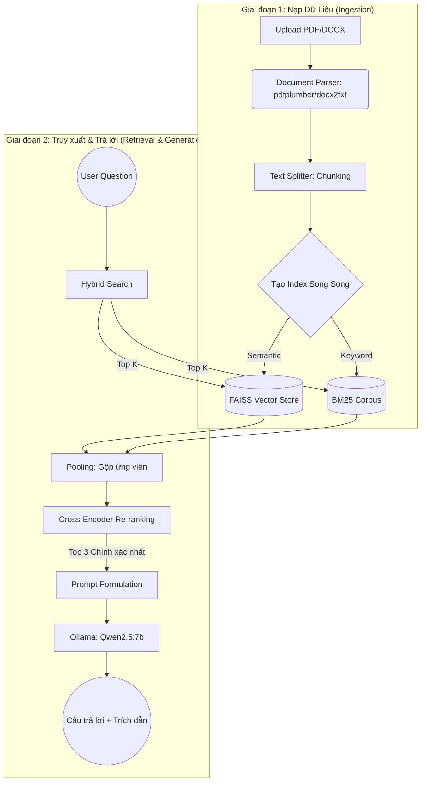

# BÁO CÁO TỔNG KẾT DỰ ÁN: XÂY DỰNG ỨNG DỤNG TRỢ LÝ ẢO HỎI ĐÁP TÀI LIỆU DỰA TRÊN KIẾN TRÚC RAG VÀ MÔ HÌNH NGÔN NGỮ LỚN CỤC BỘ

## MỞ ĐẦU

**Tóm tắt:** Báo cáo này trình bày quá trình phát triển và xây dựng ứng dụng SmartDoc AI - một phần mềm trợ lý ảo hỏi đáp tài liệu chuyên dụng hoạt động trên môi trường cục bộ. Hệ thống được thiết kế dựa trên kiến trúc RAG (Retrieval-Augmented Generation) kết hợp mô hình ngôn ngữ lớn Qwen2.5:7b được vận hành nội bộ qua nền tảng Ollama. Điểm đột phá về mặt kỹ thuật của ứng dụng là việc áp dụng cơ chế Tìm kiếm lai (Hybrid Search: kết hợp FAISS và BM25) cùng mô hình chấm điểm chéo (Cross-Encoder Re-ranking) để tối ưu hóa tuyệt đối độ chính xác của thông tin trích xuất. Hệ thống đảm bảo tính bảo mật dữ liệu ở mức tối đa (100% offline), đồng thời giải quyết triệt để vấn đề ảo giác (hallucination) của trí tuệ nhân tạo thông qua cơ chế trích dẫn nguồn tham khảo minh bạch.

**Từ khóa:** RAG, LLM cục bộ, Hybrid Search, FAISS, BM25, Cross-Encoder, Ollama, Qwen2.5.

## CHƯƠNG I: GIỚI THIỆU TỔNG QUAN

### 1.1 Mục tiêu phát triển ứng dụng

- Xây dựng một phần mềm web hoàn chỉnh, cung cấp giao diện trực quan cho phép người dùng giao tiếp và truy vấn thông tin từ các khối tài liệu văn bản (PDF, DOCX) bằng ngôn ngữ tự nhiên.
- Khắc phục các hạn chế về độ chính xác của các hệ thống RAG truyền thống thông qua việc tích hợp sâu cơ chế Tìm kiếm lai (Hybrid Search) và Sắp xếp lại ứng viên (Re-ranking) vào lõi xử lý.
- Đảm bảo tính bảo mật và quyền an toàn thông tin 100% bằng cách triển khai toàn bộ đường ống AI (từ công đoạn Embedding đến Generation) hoàn toàn trên môi trường máy chủ cục bộ (Localhost), không phụ thuộc vào Internet.

### 1.2 Đối tượng sử dụng

Hệ thống hướng tới các cá nhân, doanh nghiệp, và tổ chức chuyên ngành (như pháp lý, y tế, giáo dục, tài chính) có nhu cầu xử lý, tra cứu khối lượng lớn tài liệu nội bộ nhưng bị ràng buộc bởi các quy định nghiêm ngặt về bảo mật thông tin, hoàn toàn không được phép tải dữ liệu lên các nền tảng đám mây công cộng của bên thứ ba (như OpenAI, Google).

### 1.3 Cơ sở lý thuyết

- **RAG (Retrieval-Augmented Generation):** Kiến trúc kết hợp giữa việc tìm kiếm thông tin bên ngoài và khả năng sinh văn bản của LLM. LLM không tự trả lời bằng kiến thức học được, mà chỉ tổng hợp câu trả lời từ các đoạn văn bản (context) do hệ thống tìm kiếm nội bộ cung cấp.
- **Hybrid Search:** Khắc phục nhược điểm của Vector Search (chỉ hiểu ngữ nghĩa, kém nhạy bén trong việc tìm từ khóa chính xác) bằng cách vận hành song song với Keyword Search (thuật toán BM25 - xuất sắc trong việc quét mã số, tên riêng và thuật ngữ cứng).
- **Cross-Encoder Re-ranking:** Kỹ thuật thẩm định lại các đoạn văn bản ứng viên. Thay vì chỉ tính khoảng cách vector đơn thuần, Cross-Encoder đưa cả câu hỏi và đoạn văn vào cùng một mạng Transformer để đánh giá mức độ liên quan chéo, mang lại điểm số chính xác vượt trội.

## CHƯƠNG II: THIẾT KẾ VÀ TRIỂN KHAI HỆ THỐNG

### 2.1 Yêu cầu hệ thống

Để triển khai và vận hành hệ thống thành công, máy chủ lưu trữ cần đáp ứng các tiêu chuẩn sau:

- **Phần cứng:** CPU 8 cores, RAM tối thiểu 16GB (khuyến nghị 32GB để chạy mượt LLM 7B), Ổ cứng trống >15GB, GPU (Tùy chọn, tối thiểu 6GB VRAM để tăng tốc xử lý suy luận).
- **Phần mềm:** Hệ điều hành Windows/Linux/macOS, Python 3.12+, Ollama Runtime.
- **Công nghệ cốt lõi:** Django 5.0 (Backend), TailwindCSS (Frontend), SQLite3 (Database), LangChain (RAG Framework), FAISS & BM25 (Search Engine).

### 2.2 Ý tưởng xây dựng và Kiến trúc hệ thống

Ý tưởng cốt lõi của ứng dụng là tạo ra một đường ống (pipeline) xử lý dữ liệu tự động hóa: Từ thời điểm người dùng tải file lên, tài liệu lập tức được phân giải, băm nhỏ và lưu trữ có cấu trúc. Khi người dùng phát lệnh truy vấn, hệ thống thực hiện sàng lọc thông tin qua 2 lớp khắt khe (Retrieval -> Re-ranking) trước khi chuyển giao cho LLM sinh phản hồi.

#### Sơ đồ Kiến trúc luồng RAG (RAG Pipeline Architecture)

#### Cấu trúc Hệ thống Cơ sở dữ liệu

Ứng dụng sử dụng cơ sở dữ liệu quan hệ (SQLite3) với các thực thể (models) chính được liên kết chặt chẽ nhằm quản lý toàn vẹn dữ liệu người dùng và lịch sử làm việc:

- **User:** Bảng quản lý định danh người dùng. Lưu trữ các trường cơ bản như ID, tên hiển thị, và thời gian khởi tạo.
- **Conversation:** Bảng quản lý siêu dữ liệu của từng phiên làm việc (phiên trò chuyện). Có khóa ngoại liên kết với bảng User. Lưu trữ tiêu đề phiên, thời gian cập nhật gần nhất để phục vụ hiển thị trên Dashboard.
- **Document:** Bảng lưu vết chi tiết của từng file vật lý được tải lên. Có khóa ngoại liên kết với bảng Conversation. Lưu trữ tên file gốc, đường dẫn lưu trữ an toàn trên server, và dung lượng tệp.
- **Message:** Bảng lưu trữ chi tiết luồng hội thoại. Liên kết trực tiếp với bảng Conversation. Ghi nhận vai trò (User hoặc Assistant), nội dung đoạn chat, và một trường dữ liệu định dạng JSON chuyên biệt để lưu trữ toàn bộ nguồn trích dẫn (citations) đi kèm với câu trả lời của AI.

### 2.3 Các tính năng chính của hệ thống

#### 2.3.1 Phân tích Thiết kế và Giao diện Người dùng (UI/UX)

Hệ thống được thiết kế dựa trên nguyên tắc tối giản hóa nhận thức (Cognitive Load Reduction), tập trung tuyệt đối vào luồng công việc chính của người dùng. Dưới đây là phân tích chi tiết dựa trên 3 màn hình giao diện cốt lõi:

**1. Trang chủ và Định danh (Home Page)**

- **Tối giản và Tập trung:** Giao diện chào mừng được thiết kế với không gian trắng (white-space) rộng rãi, loại bỏ hoàn toàn các yếu tố gây xao nhãng. Tại trung tâm, hệ thống tự động nhận diện người dùng cũ (Ví dụ: _"Chào mừng bạn quay trở lại, Duong Donate!"_) kết hợp với một dấu tick xanh tạo cảm giác an tâm.
- **Nút Call-to-Action (CTA):** Nút _"Vào trò chuyện ngay"_ được thiết kế với màu đen tương phản mạnh, thu hút thị giác và định hướng người dùng click ngay lập tức.
- **Giá trị cốt lõi:** Phía dưới màn hình hiển thị trực quan 3 cam kết hệ thống thông qua các icon tối giản: Phản hồi tức thì, Câu trả lời chính xác, và Bảo mật & Riêng tư, giúp củng cố niềm tin cho doanh nghiệp.

**2. Bảng điều khiển Hội thoại (Dashboard)**

- **Cấu trúc Grid Layout:** Danh sách lịch sử trò chuyện được bố trí theo dạng lưới 2 cột. Các thẻ (Card) có bo góc mềm mại, hiển thị rõ ràng tiêu đề (in đậm), nội dung tóm tắt preview, timestamp và tổng số lượng tin nhắn (Ví dụ: 48 tin nhắn). Thiết kế này giúp người dùng dễ dàng quét (scan) và tìm kiếm lại các dự án cũ.
- **Khởi tạo nhanh:** Nút _"Trò chuyện mới"_ được bố trí ở góc phải trên cùng, đồng bộ với thanh điều hướng (Navbar), giúp người dùng dễ dàng thao tác tạo luồng công việc mới bất kể họ đang cuộn trang ở vị trí nào.

**3. Không gian Trò chuyện (Chat Interface)** Giao diện Chat áp dụng bố cục 3 cột (Three-column layout) tinh vi, phân chia rạch ròi các nhóm chức năng:

- **Cột trái (Công cụ & Lịch sử):** Chứa khu vực _"Cấu hình Chunk"_ với các thanh trượt (slider) trực quan cho phép điều chỉnh Chunk Size và Chunk Overlap, kèm nút _"Áp dụng & Xử lý lại"_. Ngay bên dưới là danh sách _"Câu hỏi gần đây"_ giúp người dùng thao tác lại nhanh chóng mà không cần gõ phím.
- **Cột giữa (Tương tác AI):** Không gian tương tác chính sử dụng cấu trúc Bubble Chat. Tin nhắn người dùng mang màu đen, trong khi phản hồi của AI sử dụng nền xám nhạt để phân biệt. Điểm nhấn UX đáng giá nhất là **Chip Trích Dẫn (Citations)** màu xanh lá hiển thị chi tiết tên file và số trang (Ví dụ: _[SmartDOC_Demo.pdf] (Trang 2)_), mang lại sự minh bạch tuyệt đối về nguồn gốc thông tin.
- **Cột phải (Quản lý Tài nguyên):** Bảng điều khiển _"Tài liệu"_ hiển thị trực quan các file đã tải lên (dạng Card màu xanh lá cho PDF), hiển thị rõ dung lượng (130KB, 2.2MB) và trạng thái _"Đã sẵn sàng"_. Khu vực này cũng bố trí các nút chức năng quản trị cấp độ cao như _"Tải lên tài liệu"_, _"Xóa tài liệu"_ (màu đỏ cảnh báo), và _"Xóa lịch sử"_.

#### 2.3.2 Quản lý tài liệu (Document Management)

- **Đa định dạng:** Hỗ trợ xử lý văn bản chuyên sâu từ PDF và DOCX.
- **Tải lên cộng dồn (Incremental Upload):** Cho phép tải lên nhiều file cùng lúc và bổ sung tài liệu mới, tự động gộp vào cơ sở dữ liệu vector hiện hành mà không làm mất cấu trúc tri thức cũ.
- **Lưu trữ Vector cứng (Persistent Vector Storage):** Cơ chế tự động sao lưu FAISS Index xuống ổ cứng vật lý. Hỗ trợ phục hồi trạng thái với tốc độ cao khi làm mới trang (F5).

#### 2.3.3 Tương tác RAG (Hỏi đáp)

- **Tùy chỉnh thuật toán băm (Chunking):** Giao diện kỹ thuật cho phép điều chỉnh Chunk Size (600-1500) và Overlap (50-150) theo đặc thù tài liệu.
- **Trích dẫn nguồn minh bạch (Exact Citation):** LLM khi sinh câu trả lời bắt buộc phải đính kèm metadata rõ ràng theo định dạng `[Tên File] (Trang X)`.
- **Bảo vệ người dùng:** Tích hợp Modal xác nhận, Tooltip cảnh báo an toàn trước các thao tác có nguy cơ phá hủy dữ liệu.

### 2.4 Chi tiết Logic xử lý trong hệ thống RAG

Để đảm bảo chất lượng thông tin cung cấp cho mô hình ngôn ngữ lớn (LLM) và mang lại trải nghiệm tương tác mượt mà nhất, hệ thống RAG được thiết kế với các logic xử lý chuyên sâu ở từng khâu:

#### 2.4.1 Cơ chế Xử lý đa tài liệu (Multiple File Parsing Logic)

Ứng dụng không giới hạn việc xử lý một file đơn lẻ mà hỗ trợ mảng dữ liệu đa tệp tin. Khi người dùng nạp danh sách file (Multiple files), backend thực thi vòng lặp cô lập để xử lý từng tệp:

- **Nhận diện định dạng:** Kiểm tra phần mở rộng tệp tin (MIME type). Đối với định dạng PDF, kích hoạt parser `pdfplumber` để bóc tách text kèm tọa độ metadata (như số trang). Đối với định dạng DOCX, kích hoạt parser `docx2txt`.
- **Làm sạch và Gộp văn bản:** Văn bản thô từ mỗi tệp được làm sạch tự động (xóa khoảng trắng thừa, ký tự ẩn). Hệ thống tiến hành dán nhãn metadata "tên file gốc" vào từng khối dữ liệu trước khi đẩy toàn bộ vào một mảng văn bản tổng hợp lớn để chuẩn bị cho tiến trình băm.

#### 2.4.2 Thuật toán Băm dữ liệu (Chunking Strategy)

Văn bản tổng hợp được phân tách bằng thuật toán `RecursiveCharacterTextSplitter`. Thuật toán này ưu tiên thực hiện lệnh cắt tại các dấu mốc ngôn ngữ tự nhiên (như dấu phân cách đoạn `\n\n`, dấu chấm câu `.`) nhằm bảo toàn toàn vẹn ngữ nghĩa.

- **Chunk Size:** Kiểm soát kích thước tối đa của một đoạn (mặc định 900 ký tự). Thông số này đảm bảo đoạn văn mang đủ ngữ nghĩa độc lập mà không vượt quá cửa sổ ngữ cảnh (context window) của LLM.
- **Chunk Overlap:** Số lượng ký tự lặp lại (mặc định 80 ký tự) đóng vai trò làm "khớp nối" thông tin, đảm bảo một câu văn dài bị cắt làm đôi vẫn giữ được ý nghĩa logic ở phần giao thoa giữa hai đoạn.

#### 2.4.3 Logic Lưu trữ và Cập nhật cộng dồn (Incremental Storage Architecture)

Đây là logic kỹ thuật cốt lõi cho phép hệ thống tiếp nhận, phân giải và tích lũy khối lượng lớn tài liệu một cách tuần tự theo thời gian. Thay vì đòi hỏi phần cứng phải huy động tối đa tài nguyên tính toán để xử lý đồng loạt toàn bộ dữ liệu cùng một lúc – một nguyên nhân phổ biến gây ra hiện tượng tràn bộ nhớ RAM (Out-of-Memory) và làm ngưng trệ máy chủ – cơ chế này cho phép phân mảnh luồng công việc. Hệ thống có khả năng hấp thụ dần dần từng tệp tin mới được tải lên, tích hợp trơn tru chúng vào không gian vector hiện hành mà không làm ảnh hưởng hay ghi đè lên các khối tri thức đã được thiết lập từ trước.

Về mặt kiến trúc, quá trình lưu trữ vật lý được thiết kế phân tách rạch ròi thành hai phân vùng chính, gắn liền với định danh phiên làm việc (`conversation_id`) nhằm đảm bảo tính cô lập và an toàn dữ liệu:

- **Phân vùng tài liệu gốc (`media/pdfs/{conversation_id}/`):** Hệ thống lưu trữ các tệp PDF hoặc DOCX thô ngay khi tiếp nhận. Việc lưu trữ bản gốc đóng vai trò như một nguồn dữ liệu tham chiếu gốc (source of truth). Trong trường hợp người dùng ra lệnh thay đổi cấu hình thuật toán băm (Chunking Strategy), hệ thống có thể truy xuất lại các tệp gốc từ thư mục này để thực hiện băm lại tự động mà không yêu cầu người dùng phải tải lên thủ công lại từ đầu.
- **Phân vùng tri thức Vector (`media/vectorstores/{conversation_id}/`):** Đây là phân vùng lưu trữ các cơ sở dữ liệu đã qua xử lý nhúng (embedding). Thư mục này bao gồm các tệp `.faiss` (chỉ mục vector n-chiều), tệp `.pkl` (siêu dữ liệu cấu trúc của FAISS) và các tệp cấu trúc dữ liệu đã được trực tiếp hóa (serialized) thuộc thuật toán BM25.

**Cách thức thực thi cơ chế cập nhật và ghi dữ liệu:**

- **Kiểm tra trạng thái Index:** Mỗi khi có tệp tài liệu mới được tiếp nhận, hệ thống tiến hành kiểm tra sự tồn tại của cấu trúc FAISS Index và BM25 Corpus trong thư mục `media/vectorstores` tương ứng. Nếu phân vùng rỗng, hệ thống sẽ khởi tạo một cấu trúc Index hoàn toàn mới.
- **Nạp và Cập nhật Vector (Append Logic):** Trường hợp Index đã tồn tại (phiên làm việc đã chứa tài liệu trước đó), hệ thống tiến hành nạp (load) các tệp `.faiss` và `.pkl` từ ổ cứng lên bộ nhớ RAM. Các tệp văn bản mới, sau khi hoàn tất công đoạn băm, sẽ được chuyển đổi thành vector và gộp trực tiếp vào ma trận hiện có thông qua phương thức `add_embeddings` (đối với FAISS) hoặc mở rộng tệp từ vựng Corpus (đối với BM25). Quá trình này diễn ra hoàn toàn trên RAM (In-memory) để tối ưu hóa tốc độ xử lý.
- **Ghi đè vật lý (Serialization & Flush to Disk):** Sau khi dung hợp thành công toàn bộ dữ liệu cũ và mới trên RAM, cấu trúc Index cập nhật sẽ được trực tiếp hóa (serialize) và ghi đè ngược lại xuống thư mục `media/vectorstores/{conversation_id}/`. Công đoạn ghi vật lý này là bắt buộc để lưu trữ vĩnh viễn trạng thái mới nhất, đảm bảo tính toàn vẹn của không gian tri thức và cho phép khôi phục nguyên trạng (resume) trong các lần mở trình duyệt tiếp theo mà không bị thất thoát tri thức.

#### 2.4.4 Thuật toán Tìm kiếm lai (Hybrid Search)

Quá trình truy xuất dữ liệu (Retrieval) thực hiện song song hai phương pháp:

- **Luồng Semantic Search:** Sử dụng mô hình `all-MiniLM-L6-v2` để nhúng câu hỏi. Dùng FAISS tính toán khoảng cách Cosine trong không gian n-chiều để khoanh vùng ngữ nghĩa tương đồng (hỗ trợ khả năng hiểu từ đồng nghĩa).
- **Luồng Keyword Search:** Sử dụng thuật toán BM25 tính điểm TF-IDF cải tiến để đếm tần suất xuất hiện và độ hiếm của từ khóa, bắt chính xác tuyệt đối các danh từ riêng, số liệu cứng.
- **Gộp ứng viên (Pooling):** Trích xuất Top 10 đoạn văn có điểm số cao nhất từ mỗi luồng, gộp chung và loại bỏ các kết quả trùng lặp để tạo ra bộ hồ sơ ứng viên thô toàn diện và đa chiều nhất.

#### 2.4.5 Sắp xếp lại ứng viên (Cross-Encoder Re-ranking)

Để tinh lọc các thông tin "nhiễu" từ bộ hồ sơ thô, toàn bộ ứng viên được truyền tải qua mô hình `ms-marco-MiniLM-L-6-v2`. Mô hình này ghép trực tiếp chuỗi Câu hỏi và Đoạn văn ứng viên vào chung một mạng nơ-ron để thực thi cơ chế **Cross-Attention**. Từng từ trong câu hỏi sẽ được chấm điểm đối chiếu với từng từ trong đoạn văn. Sau khi hoàn tất thuật toán tính toán, điểm số mức độ liên quan (relevance score) đạt độ chính xác gần như tuyệt đối, giúp hệ thống tự tin chọn lọc ra đúng 3 đoạn văn xuất sắc nhất.

#### 2.4.6 Logic Sinh văn bản và Quản trị Prompt (Generation & Prompt Engineering)

Tiến trình LLM sinh phản hồi không hoạt động dựa trên cơ chế "trò chuyện tự do" mà tuân thủ một cấu trúc khuôn mẫu (Prompt Template) vô cùng nghiêm ngặt:

- **Cấu trúc Prompt:** Prompt được đóng gói bao gồm 3 phần: (1) **System Instruction** (Chỉ thị hệ thống: Ép buộc AI đóng vai trò một trợ lý trả lời câu hỏi hoàn toàn dựa trên văn bản được cung cấp); (2) **Context** (Ngữ cảnh: Bao gồm 3 đoạn văn bản xuất sắc nhất vừa được Cross-Encoder tuyển chọn, đính kèm tên file và số trang tương ứng); (3) **User Query** (Câu hỏi gốc của người dùng).
- **Kiểm soát tính ảo giác (Anti-Hallucination):** Trong Prompt có thiết lập các lệnh điều kiện cứng: _"Nếu thông tin không có trong Context, hãy trả lời rõ ràng là 'Tài liệu không đề cập đến thông tin này'. Tuyệt đối không tự bịa đặt"_.
- **Tóm tắt và Trích dẫn:** Thay vì chép lại nguyên văn một cách máy móc, LLM (Qwen2.5) vận dụng khả năng phân tích ngôn ngữ tự nhiên để tóm tắt các ý chính trong Context, hành văn lại một cách gãy gọn, logic, và kết thúc chuỗi suy luận bằng việc chèn định dạng Metadata trích dẫn.
- **Fallback Logic:** Nếu cơ chế tìm kiếm lai (Hybrid Search) không tìm được bất kỳ chunk nào có độ liên quan đạt chuẩn, hệ thống Backend sẽ lập tức đánh chặn yêu cầu gửi đến mô hình LLM và trả về chuỗi phản hồi từ chối mặc định. Cơ chế này giúp tối ưu hóa và tiết kiệm tối đa tài nguyên máy tính (Compute Resources).

#### 2.4.7 Logic Xử lý tương tác Giao diện (Frontend Processing Logic)

Giao diện ứng dụng được phát triển không chỉ để hiển thị mà còn đảm nhận vai trò điều hướng trạng thái thông qua luồng JavaScript thuần (Vanilla JS), giao tiếp qua phương thức bất đồng bộ (Asynchronous):

- **Cơ chế gọi API (AJAX/Fetch):** Mọi hành động từ người dùng (Upload file đa luồng, cập nhật tham số Chunking, gửi câu hỏi) đều gọi hàm `fetch()` để truyền tải các gói tin JSON đến Backend mà không yêu cầu tải lại trang (Zero-page reload).
- **Quản lý Trạng thái (State Management):** Ngay khi câu hỏi được gửi đi, UI lập tức khóa thanh nhập liệu (Disable Input) và vô hiệu hóa nút gửi để ngăn chặn tình trạng Spam API. Một khối hội thoại (Chat Bubble) tạm thời được chèn vào cây DOM đi kèm hiệu ứng "Đang suy nghĩ..." (Spinner/Typing indicator) nhằm xoa dịu tâm lý chờ đợi của người dùng.
- **Dynamic DOM Updating:** Khi Backend phản hồi thành công, Frontend tiến hành bóc tách chuỗi JSON, dỡ bỏ hiệu ứng Loading, cập nhật nội dung văn bản theo chuẩn định dạng Markdown và sinh động hóa các nút trích dẫn (Clickable Citation Chips). Đồng thời, bộ lắng nghe sự kiện (Event Listener) tự động cuộn (Auto-scroll) trục Y của màn hình xuống dưới cùng để bám sát dòng tin nhắn mới nhất.

### 2.5 Hệ thống API Endpoint

Hệ thống giao tiếp nội bộ thông qua 16 API Endpoints tuân thủ tiêu chuẩn RESTful, được phân nhóm và mô tả chi tiết trong các bảng dưới đây:

**Bảng 2.5.1: Các Endpoints Giao diện (Page Views)**

| Endpoint      | Phương thức | Chức năng                                                          |
| ------------- | ----------- | ------------------------------------------------------------------ |
| `/`           | GET         | Render trang chủ (Home)                                            |
| `/dashboard/` | GET         | Render trang bảng điều khiển (Dashboard)                           |
| `/chat/`      | GET         | Khởi tạo giao diện không gian trò chuyện mới                       |
| `/chat/<id>/` | GET         | Nạp và tải lại giao diện trò chuyện cùng dữ liệu phiên làm việc cũ |

**Bảng 2.5.2: Các Endpoints REST API (Xử lý RAG và Quản lý dữ liệu)**

| Endpoint                    | Phương thức | Chức năng                                                             |
| --------------------------- | ----------- | --------------------------------------------------------------------- |
| `/api/upload/`              | POST        | Tiếp nhận, phân giải văn bản đa luồng và cập nhật tài liệu (PDF/DOCX) |
| `/api/ask/`                 | POST        | Tiếp nhận câu hỏi và kích hoạt chuỗi luồng RAG trả lời                |
| `/api/clear-history/`       | POST        | Xóa sạch lịch sử tin nhắn trong phiên làm việc hiện tại               |
| `/api/clear-document/`      | POST        | Xóa toàn bộ tài liệu vật lý và cơ sở dữ liệu vector của phiên         |
| `/api/get-questions/`       | GET         | Truy xuất danh sách câu hỏi gần đây của phiên làm việc                |
| `/api/get-conversations/`   | GET         | Truy xuất toàn bộ danh sách phiên trò chuyện của định danh hiện tại   |
| `/api/get-user/`            | GET         | Truy xuất thông định danh hệ thống của người dùng                     |
| `/api/update-user-name/`    | POST        | Cập nhật và đồng bộ tên định danh người dùng                          |
| `/api/rename-conversation/` | POST        | Sửa đổi siêu dữ liệu tiêu đề của một phiên trò chuyện cụ thể          |
| `/api/delete-conversation/` | POST        | Kích hoạt chu trình xóa toàn bộ dữ liệu của một phiên trò chuyện      |
| `/api/get-chunk-config/`    | GET         | Truy xuất cấu hình Text Splitter đang áp dụng                         |
| `/api/update-chunk-config/` | POST        | Tiếp nhận và cập nhật cấu hình băm văn bản mới                        |

## CHƯƠNG III: KẾT QUẢ & ĐÁNH GIÁ

### 3.1 Kết quả đạt được

- Hoàn thiện và triển khai thành công ứng dụng web Full-stack đáp ứng tiêu chuẩn công nghiệp với độ trễ (latency) thao tác UI/UX ở mức thấp.
- Nền tảng RAG hoạt động mượt mà và ổn định trên phần cứng nội bộ. Mô hình Qwen2.5:7b thể hiện năng lực phản hồi và suy luận tiếng Việt xuất sắc.
- Việc tích hợp Hybrid Search kết hợp Cross-Encoder đã chứng minh hiệu quả vượt trội trong tác vụ loại bỏ thông tin nhiễu. LLM luôn tiếp nhận được ngữ cảnh chính xác nhất, từ đó triệt tiêu gần như hoàn toàn hiện tượng ảo giác (hallucination) thường gặp ở các AI tạo sinh.
- Giao diện người dùng được thiết kế trực quan, dễ thao tác, đáp ứng hoàn hảo yêu cầu theo dõi và xác minh nguồn trích dẫn tài liệu của môi trường doanh nghiệp.
- **Chỉ số đánh giá độ chính xác:** Qua quá trình thử nghiệm thực tế đối với đa dạng các loại tài liệu văn bản, các chỉ số đánh giá chất lượng của hệ thống ghi nhận mức độ tin cậy rất khả quan:
  - **Khả năng truy xuất tài liệu liên quan (Relevant document retrieval):** Đạt ngưỡng **80% - 90%**, minh chứng cho hiệu suất vượt trội của luồng tìm kiếm lai (Hybrid Search) trong việc định vị và gom cụm chính xác các khối văn bản mục tiêu.
  - **Độ liên quan của câu trả lời (Answer relevance):** Đạt ngưỡng **80% - 90%**, cho thấy mô hình ngôn ngữ lớn tuân thủ và bám sát thành công vào ngữ cảnh (context) được cung cấp, giúp câu trả lời giải quyết trực diện trọng tâm truy vấn của người dùng.
  - **Độ chính xác thực tế (Factual accuracy):** Đạt ngưỡng **70% - 90%** (dao động biên độ tùy thuộc vào độ phức tạp của chuyên ngành và mức độ cụ thể của câu hỏi), khẳng định năng lực chống ảo giác (anti-hallucination) vững chắc và khả năng bảo toàn tính chân thực của thông tin gốc.

### 3.2 Đề xuất các bộ Test (Test Cases) để đánh giá hệ thống

Nhằm đo lường một cách khách quan hiệu năng của kiến trúc Hybrid Search, dự án đề xuất và áp dụng các bộ kiểm thử sau:

- **Test Case 1: Đánh giá độ chính xác từ khóa (BM25 Strength)**
  - _Kịch bản:_ Tải lên tài liệu Pháp luật. Đặt câu hỏi: _"Theo Nghị định 15/2020/NĐ-CP, mức phạt là bao nhiêu?"_
  - _Kỳ vọng:_ Ứng dụng trích xuất chính xác số liệu và điều khoản nhờ sức mạnh của thuật toán BM25, tuyệt đối không bị nhầm lẫn với các Nghị định khác có văn phong tương đồng.
- **Test Case 2: Đánh giá khả năng thấu hiểu ngữ nghĩa (FAISS Strength)**
  - _Kịch bản:_ Tải lên tài liệu kỹ thuật có chứa cụm từ "xe ô tô hai cầu". Đặt câu hỏi: _"Quy định về phương tiện bốn bánh dẫn động toàn thời gian?"_
  - _Kỳ vọng:_ Ứng dụng vẫn định vị đúng đoạn văn bản nhờ FAISS thấu hiểu được sự tương đồng về mặt ý nghĩa cho dù không có bất kỳ từ khóa nào khớp hoàn toàn.
- **Test Case 3: Đánh giá khả năng chống Ảo giác (Anti-Hallucination Test)**
  - _Kịch bản:_ Đặt câu hỏi truy vấn một thông tin hoàn toàn không tồn tại trong tài liệu đã tải lên (Ví dụ: _"Ai là tổng thống Mỹ năm 2024?"_).
  - _Kỳ vọng:_ LLM tuân thủ Prompt, từ chối trả lời hoặc phản hồi thông báo tài liệu không chứa thông tin này, không tự ý sử dụng lượng kiến thức tiền huấn luyện (pre-trained knowledge) để sáng tác câu trả lời.
- **Test Case 4: Đánh giá tính năng Tải lên cộng dồn (Incremental Test)**
  - _Kịch bản:_ Nạp File A -> Hỏi về File A -> Tiếp tục nạp thêm File B -> Hỏi thông tin yêu cầu xâu chuỗi dữ liệu giữa File A và File B.
  - _Kỳ vọng:_ Trả lời chính xác, chứng minh Vector Index đã được dung hợp thành công trên RAM mà không làm thất thoát hay ghi đè dữ liệu của File A.

## KẾT LUẬN & HƯỚNG PHÁT TRIỂN

Dự án đã hoàn thiện và thành công trong việc xây dựng, triển khai một Ứng dụng Trợ lý ảo hỏi đáp tài liệu cục bộ hoàn chỉnh. Thông qua việc kết hợp các công nghệ mã nguồn mở tiên tiến hàng đầu (Django, LangChain, FAISS, Ollama) và ứng dụng kiến trúc RAG cấu hình cao (Hybrid Search + Re-ranking), phần mềm không chỉ giải quyết triệt để bài toán tra cứu thông tin nhanh chóng mà còn đảm bảo độ tin cậy tuyệt đối. Tính minh bạch được thiết lập qua cơ chế trích dẫn nguồn, và quan trọng nhất, ứng dụng đã đáp ứng hoàn hảo yêu cầu bảo vệ an toàn dữ liệu nội bộ của người dùng. Hệ thống có độ hoàn thiện cao và hoàn toàn có khả năng ứng dụng thực tiễn tại các doanh nghiệp.

Mặc dù ứng dụng hiện tại đã hoạt động cực kỳ ổn định và đáp ứng toàn diện các yêu cầu kỹ thuật đề ra, hệ thống vẫn sở hữu nhiều tiềm năng để tiếp tục nâng cấp trong tương lai:

1. **Tích hợp OCR (Optical Character Recognition):** Mở rộng khả năng đọc hiểu tài liệu thông qua việc tích hợp các engine OCR (như Tesseract) để xử lý các tệp PDF dạng ảnh quét (scanned documents) hoặc dữ liệu hình ảnh chứa văn bản.
2. **Mở rộng định dạng đầu vào:** Phát triển module Parser để bổ sung khả năng phân tích các định dạng có cấu trúc bảng biểu phức tạp như Excel (.xlsx), CSV, hoặc các bản trình bày PowerPoint (.pptx).
3. **Hệ thống xác thực người dùng (Authentication):** Nâng cấp module User hiện hành thành một hệ thống đăng nhập/đăng ký có mật khẩu, áp dụng phân quyền chuẩn mực (Sử dụng JWT hoặc Session bảo mật) thay vì chỉ xác thực định danh cơ bản qua tên.
